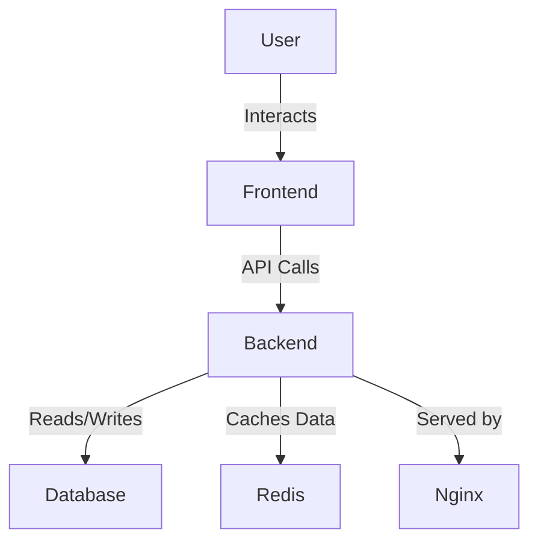

# TaskMaster Architecture

## System Design Overview

TaskMaster is designed as a modular and scalable system with a clear separation of concerns between the frontend, backend, and infrastructure components.

### Architecture Diagram

### Components Description

- **Frontend**: Built using Next.js with TypeScript for creating a responsive and interactive user interface. It uses React Query and Zustand for state management.
- **Backend**: Developed with FastAPI, a modern web framework for building APIs with Python 3.7+. The backend handles business logic and data processing.
- **Database**: PostgreSQL is used for persistent storage, while Redis is employed for caching and session management.
- **Infrastructure**: Docker and Docker Compose ensure consistent environment setup across different stages of development and production.

### Data Flow

1. **User Interaction**: Users interact with the frontend application.
2. **API Requests**: The frontend makes API calls to the backend for data operations.
3. **Database Operations**: The backend interacts with PostgreSQL for CRUD operations and uses Redis for caching.
4. **Response**: Processed data is sent back to the frontend for user display.