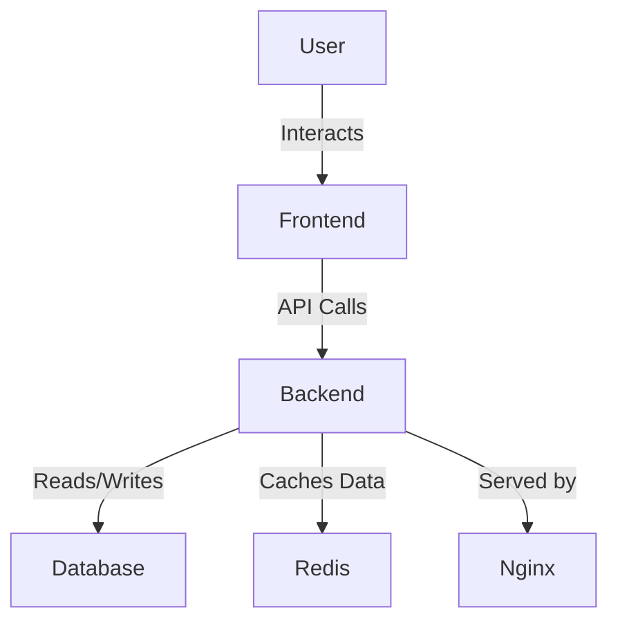

# TaskMaster


> Organize your tasks effortlessly

TaskMaster is a productivity application designed to help busy professionals and students manage their tasks with ease. It offers a comprehensive set of features to ensure that users can prioritize, track, and complete tasks efficiently.

## Features

- ✓ User Registration
- ✓ User Authentication
- ✓ Task Creation
- ✓ Task Editing
- ✓ Task Deletion
- ✓ Task Prioritization
- ✓ Task Notifications
- ✓ Task Completion Tracking
- ✓ Task Categorization

## Quick Start

1. Clone the repository:
   ```bash
   git clone https://github.com/yourusername/taskmaster.git
   ```
2. Navigate to the project directory:
   ```bash
   cd taskmaster
   ```
3. Start the application using Docker:
   ```bash
   docker-compose up -d
   ```

## Prerequisites

| Tool         | Version |
|--------------|---------|
| Docker       | 20.10+  |
| Docker-Compose | 1.29+ |
| Node.js      | 16+     |
| Python       | 3.9+    |

## Docker Compose Setup

```yaml
docker-compose:
  version: '3.7'
  services:
    web:
      build: ./frontend
      ports:
        - '3000:3000'
    api:
      build: ./backend
      ports:
        - '8000:8000'
    db:
      image: postgres:15
      environment:
        POSTGRES_USER: user
        POSTGRES_PASSWORD: password
    redis:
      image: redis:7
```

## API Usage Examples

### Register a New User
```bash
curl -X POST "http://localhost:8000/api/v1/auth/register" -H "Content-Type: application/json" -d '{"email": "user@example.com", "password": "securepassword"}'
```

### Create a Task
```bash
curl -X POST "http://localhost:8000/api/v1/tasks" -H "Authorization: Bearer <access_token>" -H "Content-Type: application/json" -d '{"title": "New Task", "description": "Description", "due_date": "2023-12-31", "priority": "High"}'
```

## Environment Variables

| Name               | Required | Default | Description                     |
|--------------------|----------|---------|---------------------------------|
| `DATABASE_URL`     | Yes      |         | Database connection string      |
| `REDIS_URL`        | Yes      |         | Redis connection string         |
| `JWT_SECRET`       | Yes      |         | Secret key for JWT encryption   |
| `FRONTEND_URL`     | No       | http://localhost:3000 | Frontend application URL |

## Architecture Diagram



## Tech Stack

| Component    | Details                                    |
|--------------|--------------------------------------------|
| Backend      | Python, FastAPI, SQLAlchemy, Pydantic      |
| Frontend     | Next.js, TypeScript, Tailwind CSS, Zustand |
| Database     | PostgreSQL, Redis                          |
| Infrastructure | Docker, GitHub Actions, Nginx           |

For more detailed documentation, visit the [docs folder](./docs).